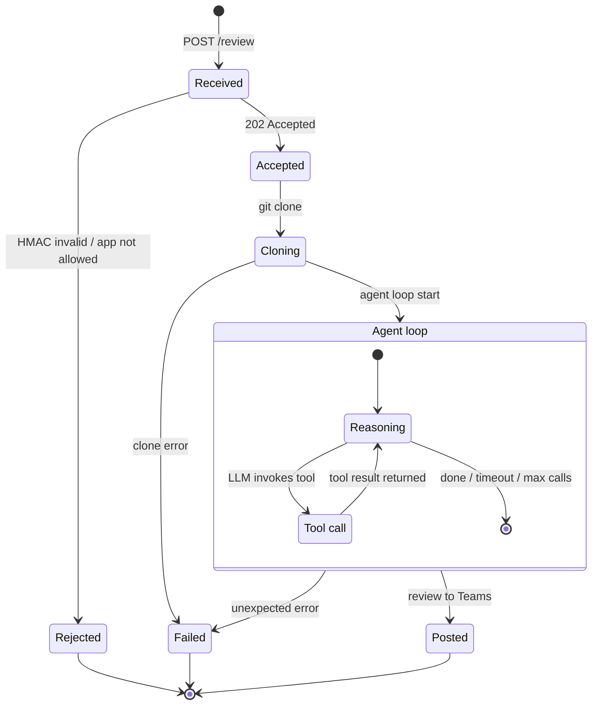

# Mendix Commit Review Service

Receives Mendix Pipeline webhooks, reviews the commit with an agentic LLM loop, and posts results to Microsoft Teams.

- Multi-LLM support via LiteLLM (Claude, OpenAI, Gemini, Azure OpenAI)
- Agentic mxcli navigation — LLM calls read-only tools to explore the Mendix model
- Teams Adaptive Card output with structured review findings
- HMAC-SHA256 signed webhooks with replay protection

## How it works



The agent loop runs in the background after the webhook is acknowledged. The LLM receives a system prompt and iteratively calls read-only mxcli tools to navigate the Mendix model — inspecting the diff, fetching element context, running lint rules, and searching captions. After at most 25 tool calls (or `REVIEW_TIMEOUT_SECONDS`), it produces a structured review that is posted to Teams as an Adaptive Card.

## Prerequisites

- Python 3.12+
- [uv](https://docs.astral.sh/uv/) — fast Python package manager
- mxcli v0.12.0 binary — included in the Docker image; for local use, download from [GitHub Releases](https://github.com/mendixlabs/mxcli/releases/tag/v0.12.0) and place on `PATH`
- API key for your chosen LLM provider

## Quick start

```bash
# 1. Clone and install dependencies
git clone <this-repo> && cd mx-review-service
uv venv .venv && uv pip install -r requirements.txt --python .venv/bin/python

# 2. Configure
cp .env.example .env
# Edit .env and fill in all required values

# 3. Run
.venv/bin/uvicorn server:app --reload --port 8000

# 4. Expose locally (optional)
ngrok http 8000
```

Copy the `https://` ngrok URL and use it as the webhook URL in Mendix (see [Mendix Pipeline setup](#mendix-pipeline-setup)).

## Configuration reference

| Variable | Required | Default | Description |
|----------|----------|---------|-------------|
| `MX_PAT` | Yes | — | Mendix Personal Access Token with repo read access |
| `LLM_MODEL` | Yes | — | LiteLLM model string (see [LLM providers](#llm-providers)) |
| `TEAMS_WEBHOOK_URL` | Yes | — | Incoming Webhook URL from a Teams channel connector |
| `WEBHOOK_SECRET` | Yes | — | Shared secret for HMAC-SHA256 webhook verification |
| `ALLOWED_APP_IDS` | No | *(all)* | Comma-separated list of allowed Mendix App GUIDs; leave empty to allow all |
| `REVIEW_TIMEOUT_SECONDS` | No | `300` | Max duration of the agent loop in seconds |
| `MAX_TOOL_CALLS` | No | `25` | Max number of mxcli tool calls per review |
| `MXCLI_TOOL_TIMEOUT_SECONDS` | No | `300` | Max wait time per individual mxcli invocation |
| `MX_LOCAL_REPO` | No | — | Path to a local Mendix project directory containing the `.mpr` file; skips git clone |
| `MX_GIT_BASE_URL` | No | `https://git.api.mendix.com` | Base URL for Mendix Git API; override for self-hosted or custom environments |
| `ANTHROPIC_API_KEY` | * | — | API key for Anthropic Claude |
| `OPENAI_API_KEY` | * | — | API key for OpenAI |
| `GEMINI_API_KEY` | * | — | API key for Google Gemini |
| `AZURE_API_KEY` | * | — | API key for Azure OpenAI |
| `AZURE_API_BASE` | * | — | Azure OpenAI endpoint URL |
| `AZURE_API_VERSION` | * | — | Azure OpenAI API version (e.g. `2024-05-01-preview`) |

*\* Set the key for your chosen provider only.*

## LLM providers

Set `LLM_MODEL` and add the corresponding API key:

| Provider | `LLM_MODEL` | API key variable |
|----------|-------------|-----------------|
| Anthropic Claude | `claude-sonnet-4-6` | `ANTHROPIC_API_KEY` |
| OpenAI | `gpt-4o` | `OPENAI_API_KEY` |
| Google Gemini | `gemini/gemini-1.5-pro` | `GEMINI_API_KEY` |
| Azure OpenAI | `azure/gpt-4o` | `AZURE_API_KEY` + `AZURE_API_BASE` + `AZURE_API_VERSION` |

See the [LiteLLM providers docs](https://docs.litellm.ai/docs/providers) for all supported models.

## Docker / Podman

mxcli v0.12.0 is included in the image — no separate installation needed.

```bash
# Build
docker build -t mx-review-service .

# Run
docker run -p 8000:8000 --env-file .env mx-review-service
```

Podman works as a drop-in replacement (rootless supported):

```bash
podman build -t mx-review-service .
podman run -p 8000:8000 --env-file .env mx-review-service
```

## Mendix Pipeline setup

1. Open your app in [Mendix Portal](https://sprintr.home.mendix.com) → **Pipelines**.
2. Add a **POST Request** step after your commit trigger.
3. Set the URL to your service endpoint: `https://<your-host>/review`
4. Set the **Secret** field to the value of `WEBHOOK_SECRET` — Mendix uses this to sign the `webhook-signature` header.

## Local testing

### Without HTTP (direct invocation)

```bash
.venv/bin/python test_local.py
```

Set `MX_LOCAL_REPO` in `.env` to point at your local Mendix project directory (the one containing the `.mpr` file) to skip git clone.

### With a signed test webhook

```bash
BODY='{"appId":"8c909cbd-88ab-4a42-bcd2-3b48fc314ff4","before":"aaaaaaaaaaaaaaaaaaaaaaaaaaaaaaaaaaaaaaaa","after":"bbbbbbbbbbbbbbbbbbbbbbbbbbbbbbbbbbbbbbbb","branchName":"main","authorName":"Test","commitMessage":"Test commit"}'
TS=$(date +%s)
WID="test-$(uuidgen)"
SECRET="your-webhook-secret"
SIG="v1,$(echo -n "${WID}.${TS}.${BODY}" | openssl dgst -sha256 -hmac "$SECRET" -binary | base64)"

curl -X POST http://localhost:8000/review \
  -H "Content-Type: application/json" \
  -H "webhook-id: $WID" \
  -H "webhook-timestamp: $TS" \
  -H "webhook-signature: $SIG" \
  -d "$BODY"
```

## Running tests

```bash
.venv/bin/pytest tests/ -v
```
